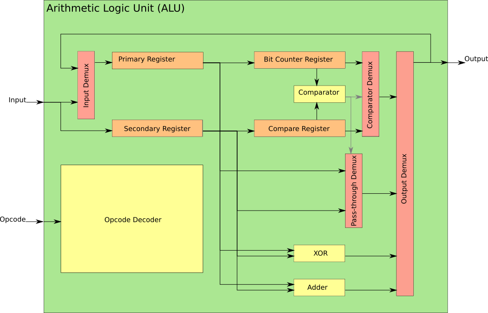

# Arithmetic Logic Unit (ALU)
The ALU is responsible for performing the major arithmetic operations necessary to compute the hash, such as addition, XOR, and bit rotation. It is also responsible for comparing the computed hash value to find the best possible hash.

## Design Requirements
- 64-bit word size
- Addition
- XOR
- Rotate Right
- Rotate Left
- Bit Counter
- Result Comparison
  - Given the following variables:
    - best_nonce - The nonce used to calculate the best result.
    - best_bits - The number of bits off target for the best computed value.
    - result_nonce - The nonce used to calculate the newly computed hash value.
    - result_bits - The number of bits off target of the newly computed hash value.
  - If result_bits < best_bits:
    - best_nonce = result_nonce
    - best_bits = result_bits
- Pass-through to RAM and main-bus

## Components

### Registers

#### Primary Register
The primary register is 64-bits wide. It differs from the Secondary Register in that it can have its LSB counted by the Bit Counter Register and that it can shift left 1-bit at a time. The 1-bit shift is to support the Rotate operation necessary for Skein hash calculation.

This register allows 16-bit left shifts because the Spartan 6 block RAM that is being used only supports a 16-bit wide data bus.

#### Secondary Register
The Secondary Register is 64-bits wide and is generally used to store an operand for an ALU operation.

This register allows 16-bit left shifts because the Spartan 6 block RAM that is being used only supports a 16-bit wide data bus.

#### Bit Counter Register
The Bit Counter Register is 10-bits wide and serves two functions: bit counting and comparison. To calculate the number of bits off from the XKCD target, the bits must be counted. Subsequently to compare each hash's bits-off-target with the best hash's bits-off-target, this register is used.

#### Comparator Register
Used to store the current best hash-bits-off count to be compared with the hash that was just calculated.

### Combinational

#### Opcode Decoder
Decodes the 4-bit opcode input to control the 12 control bits of the ALU.

#### Comparator
The Comparator finds the lowest value between the Bit Counter Register and the Compare Register and selects the register with the lowest value on the Comparator Demux. In addition, it also selects the corresponding nonce value that goes with each bits-off count. This happens on the Pass-through Demux. Nonce values must be stored in the Primary and Secondary Registers. The comparator is implemented as described [here](https://en.wikipedia.org/wiki/Digital_comparator#Implementation).

#### XOR
64-bit XOR of Primary and Secondary for use in Skein hash calculation

#### Adder
64-bit adder that adds the Primary and Secondary Registers for use in Skein hash calculation.

### Demultiplexers

#### Pass-through Demultiplexer
Has two modes. The first simply selects the Primary Register value and passes it through to the output. This is used to write values to the RAM. The second mode allows the Comparator to select the nonce value of the best hash available.

#### Comparator Demultiplexer
The Comparator Demultiplexer has two modes, the first mode simply selects the Bit Counter value. TODO: This may not be necessary, as the bit count value calculated could just remain here while the best bit count is loaded to the compare register. The second mode allows the Comparator to select the lowest of the Bit Counter Register and the Compare Register and push that value to the Output Demux.

#### Output Demultiplexer
The Output Demultiplexer allows the selection of what goes to the output of the ALU. There are four inputs to this demultiplexer and one output.

## Operations
- Write Primary Register
- Write Primary Register Lower 16-bits
- Rotate Primary Register Left 16-bits
- Rotate Primary Register Left 1-bit and Increment Bit Counter
- Write Secondary Register
- Write Secondary Register Lower 16-bits
- Rotate Secondary Register Left 16-bits
- XOR
- Add
- Write Bit Counter
- Write Comparator Register & Compare
- Comparator Nonce Pass-through
- Primary Register Pass-through

## Control Bits
The ALU has 13 total control bits, shown as follows:

- 3 bits for Primary Register
  - 000: Idle
  - 110: Write lowest 16 bits
  - 111: Write full 64 bits
  - 010: Rotate left 16 bits
  - 001: Rotate left 1 bit
- 2 bits for Secondary Register
  - 00: Idle
  - 01: Rotate left 16 bits
  - 10: Write lowest 16 bits
  - 11: Write full 64 bits
- 2 bits for Bit Counter Register
  - Write
  - Increment
- 1 bit for Comparator Register
  - Write
- 1 bit for Comparator Demux
  - Select Bit Counter Register
    - If HIGH select Bit Counter Register
    - If LOW use Comparator selection.
  - Note: There is another internal bit from the Comparator, this selects the value that is the lowest in the comparator.
- 1 bit for Pass-through demux
  - Select Primary
    - If HIGH select Primary Register
    - If LOW use Comparator selection.
  - Note: There is another internal bit from the Comparator, this selects the value that is the lowest in the comparator. If Compare Register is lowest, select Secondary Register. If Bit Counter Register is lowest select Primary Register
- 2 bits for Output Demux
  - 00: Comparator Demux
  - 01: Pass-through Demux
  - 10: XOR
  - 11: Adder

### Opcode Decoding
| Operation                                                    | Primary Register | Secondary Register | Bit Counter Register | Comparator Register | Comparator Demux | Pass-through Demux | Output Demux |
| ------------------------------------------------------------ | ---------------- | ------------------ | -------------------- | ------------------- | ---------------- | ------------------ | ------------ |
| Write Primary Register                                       | 111              | 00                 | 00                   | 0                   | X                | X                  | XX           |
| Write Primary Register Lower 16-bits                         | 110              | 00                 | 00                   | 0                   | X                | X                  | XX           |
| Rotate Primary Register Left 16-bits                         | 010              | 00                 | 00                   | 0                   | X                | X                  | XX           |
| Rotate Primary Register Left 1-bit and Increment Bit Counter | 001              | 00                 | 01                   | 0                   | X                | X                  | XX           |
| Write Secondary Register                                     | 000              | 11                 | 00                   | 0                   | X                | X                  | XX           |
| Write Secondary Register Lower 16-bits                       | 000              | 10                 | 00                   | 0                   | X                | X                  | XX           |
| Rotate Secondary Register Left 16-bits                       | 000              | 01                 | 00                   | 0                   | X                | X                  | XX           |
| XOR                                                          | 000              | 00                 | 00                   | 0                   | X                | X                  | 10           |
| Add                                                          | 000              | 00                 | 00                   | 0                   | X                | X                  | 11           |
| Write Bit Counter                                            | 000              | 00                 | 10                   | 0                   | X                | X                  | XX           |
| Write Comparator Register & Compare                          | 000              | 00                 | 00                   | 1                   | 0                | X                  | 00           |
| Comparator Nonce Pass-through                                | 000              | 00                 | 00                   | 0                   | X                | 0                  | 01           |
| Primary Register Pass-through                                | 000              | 00                 | 00                   | 0                   | X                | 1                  | 01           |
