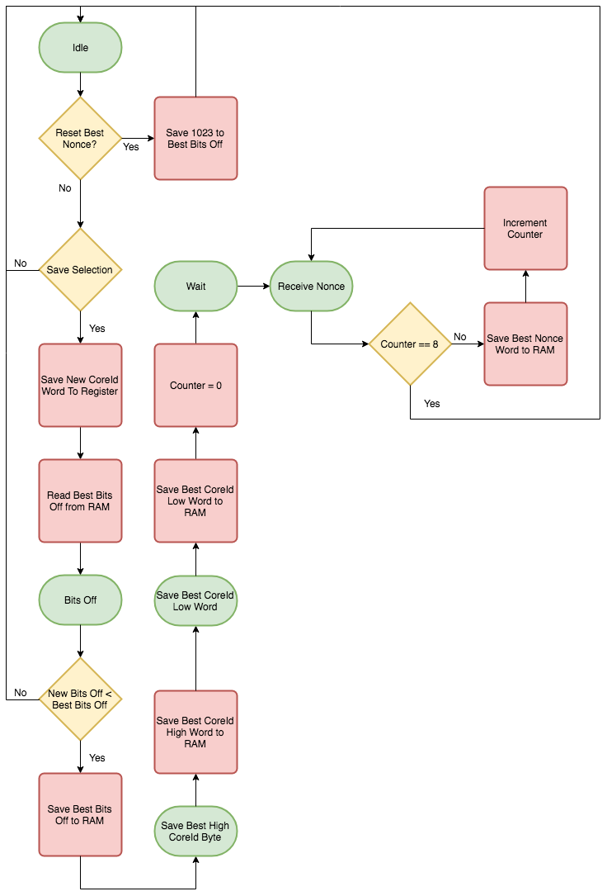

# Best Nonce Module

The best nonce module will read core-specific best nonce values from the main
bus and determine the chip-specific best nonce value. To do this, the module
uses the same `Save Selection` signal used by the cores.

The Best Nonce Module shares a block RAM with the Serial Module.

## Usage
### Comparison
1. Using the CoreId for the Core to be compared by the Best Nonce Module, drive
the CoreId on the main bus.
2. While the CoreId is on the main bus, use the SelectCore instruction. This
will drive the Save Selection bit high, which will select the core as well as
prepare the Best Nonce Module for nonce comparison.
3. Read the core-specific best bits off word.
4. Read the two core-specific best nonce words.
5. After receiving all necessary information, the Best Nonce Module will
automatically compare the received best bits off with its current best best
bits off. If the new one is lower, then the bits off, CoreId, and nonce value
will be saved to the Best Nonce Modules RAM.
### Initialization/Reset
1. Set the reset_best_nonce_i bit to high. This will write the value 1023 to
the bits off address. When the next nonce is compared, it will certainly be
less than 1023.

## Timing
This shows what is happening each clock cycle.
1. SelectCoreNonce <CoreId> - Save CoreId to Register
2. Read BITS_OFF (4 Clocks) - Compare and Save Best Bits off to RAM (If new nonce isn't better, no other RAM operations happen after this point.)
3. Save High CoreId to RAM
4. Save Low CoreId to RAM
5. Wait
6. Read Best Nonce Low (4 Clocks) - Save to RAM
7. Save to RAM
8. Save to RAM
9. Save to RAM
10. Read Best Nonce High (4 Clocks) - Save to RAM
11. Save to RAM
12. Save to RAM
13. Save to RAM

## Memory Map
| Address (8-bit data)  | Address (16-bit data) | Size (bytes) | Description         |
| --------------------- | --------------------- | ------------ | ------------------- |
| 0x00                  | 0x0                   | 16           | Best Nonce          |
| 0x10                  | 0x8                   | 4*           | Best CoreId         |
| 0x14                  | 0xA                   | 2            | Best Bits Off       |
| 0x16                  | 0xB                   | 2            | New CoreId Low Word |

CoreId is 24 bits, but used 32 bits on RAM.

## IO Signals

### main_bus_i
64-bit input from the main bus.

### save_selection_i
Saves the current core selection to RAM. This also tells the Best Nonce Module
that core best bits and best nonce are about to be transmitted on the main bus.

### ram_i
16-bit input to block RAM.

### ram_o
16-bit output from block RAM.

### ram_write_o
RAM write signal

### ram_address_o
4-bit RAM address select

### reset_best_nonce_i
Erase the best nonce value from RAM so that a new set of work can begin. This
will write a very high number to the best_bits_off address.

## State Machine

