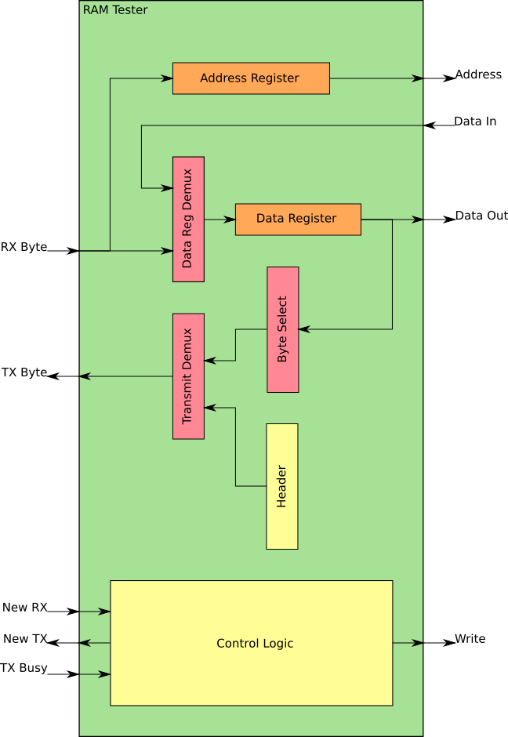

# RAM Tester
This module is used to test RAM on real FPGA hardware. It can test both the Xilinx Spartan 6 Block RAM IP core and the `block_ram.v` that I've implemented. Verification of both these RAMs is important because, to my knowledge, the Xilinx IP cannot be used with Verilator. If both modules are functionally identical, `block_ram.v` can be used for Verilator simulation.

## Components

### Address Register
8-bits wide. Used to store the address used for memory access. It is written via UART.

### Data Register
16-bits wide. Used to store either the value read from the RAM or the value that will be written to the RAM. The UART writes this register in the case of a RAM write. Since the UART is only one byte wide, the data register has two write bits. One for the high byte and one for the low byte.

### Data Register Demux
Selects between the 8-bit RX byte and the 16-bit data word coming from the RAM. The RX byte is doubled on the bus, meaning it is on both [15:8] and [7:0] of the output.

### Byte Select Demux
Selects between the high and low byte of the Data Register output. This is used to send the 16-bit data read from the RAM back to the UART, one byte at a time.

### Control Logic
Contains a state machine and a UART timeout timer for controlling the overall module.

## Control Bits
The RAM tester has 5 internal control bits.

- Address Register
  - Write
- Data Register
  - Write High Byte
  - Write Low Byte
- Data Register Demux
  - Select
    - 0: RX Byte
    - 1: Data Word
- Byte Select Demux
  - Select
    - 0: Low Byte
    - 1: High Byte

## State Machine

